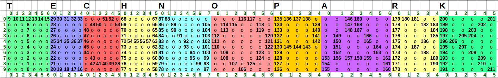

# technosign
  _The Technopark LED Sign Project_

* documentation - layout and mapping documents

* LED_RTOS - Real Time OS for the LED strip
* LED_Tester - First sign class

* index_letters - First go at usign the LED and some fun functions.
* set_led - set a single LED by serial control; for debugging.
* test_letters - rudimentary test of the strip.
